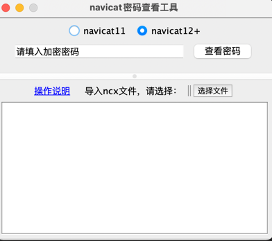

navicat密码查看工具

 

### 前期准备

<a target="_blank" href="https://blog.csdn.net/qq_42745404/article/details/105887302">navicat注册表获得或直接导出连接</a>

### 功能速览

* 1.输入模式

    > 框中输入navicat密码密文，点击查看密码，即可
    
* 2.导入模式
    
   > 选择navicat导出连接的文件（ncx后缀），上传文件后，密码信息会出现在文本框中

### 环境说明

* Java
  > java1.8+ (建议最好1.8.0_151以上的版本，因为151版本为JVM启用无限制强度管辖策略)

* Navicat
  > navicat版本（11.2.7、12.1.15、15.1.17、16.0.3上述版本均已通过测试）

### 页面展示

### 使用说明

> 此项目为[MySQLToWordOrExcel](https://github.com/Zhuoyuan1/MySQLToWordOrExcel) 的子模块项目，
> 如果此项目有帮到您，麻烦您点下star，万分感谢！！

方式一：

  直接运行 **MainIndexFrame** 即可

方式二：

  找到 *src/main/java/util/DecodeNcx* ，此工具类中有解密main方法

